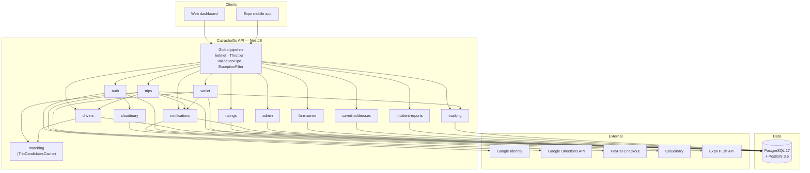
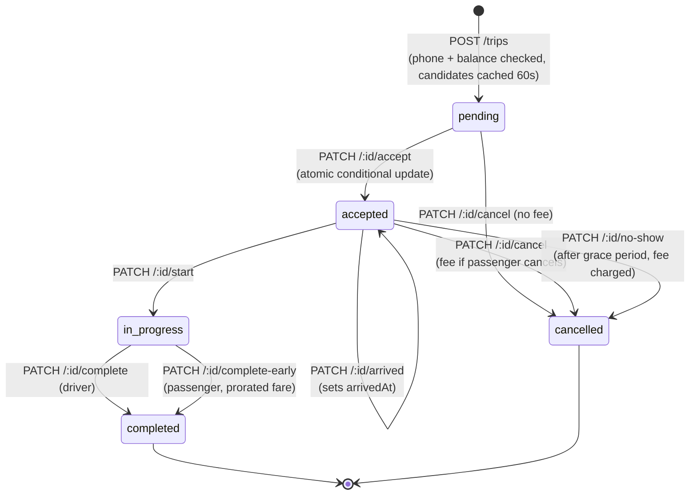
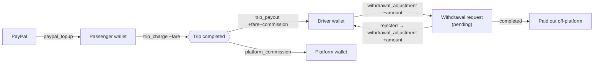
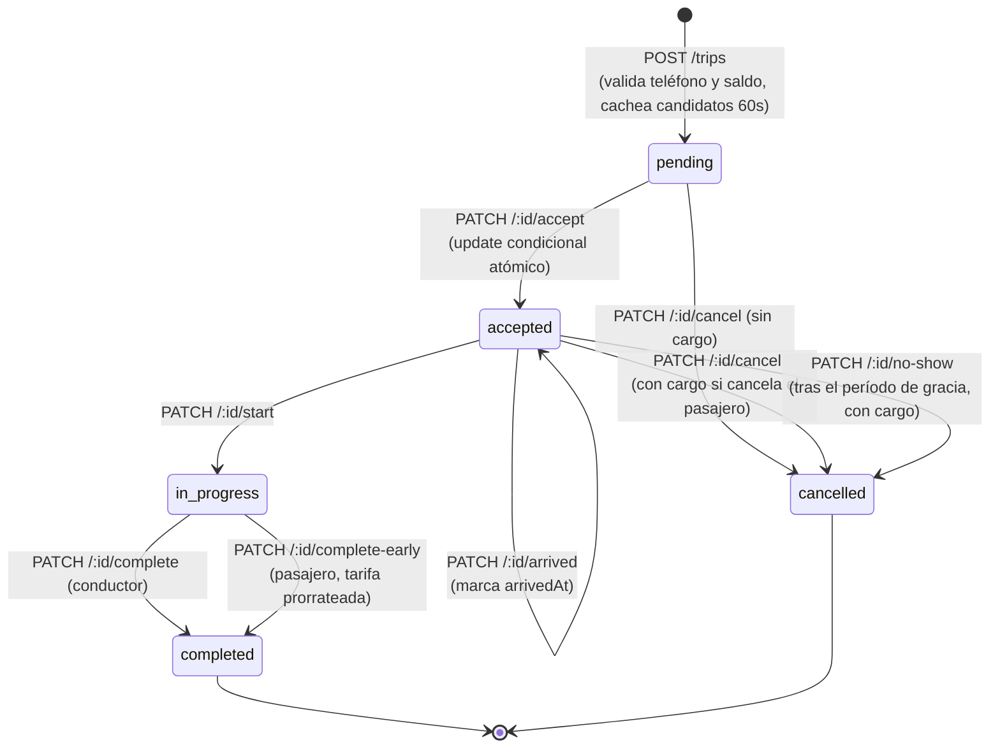
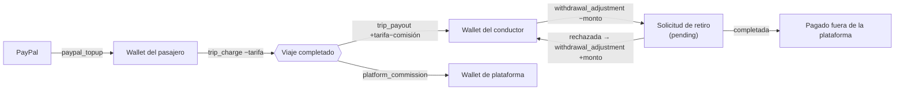

<a id="top"></a>

<div align="center">

# 🚗 CatrachoGo API

**Ride-hailing backend for Honduras — NestJS 11 · Prisma 7 · PostgreSQL + PostGIS**

[](https://nestjs.com/)
[](https://www.prisma.io/)
[](https://www.postgresql.org/)
[](https://postgis.net/)
[](https://www.typescriptlang.org/)
[](https://nodejs.org/)
[](#-license)

**[English](#english)** · **[Español](#espanol)**

</div>

---

<a id="english"></a>

# 🇬🇧 English

## Overview

**CatrachoGo API** is the backend for a ride-hailing platform built for Honduras. It is a modular NestJS monolith that exposes a REST API consumed by a web dashboard and an Expo/React Native mobile app.

It covers the full product surface:

- **Authentication** — email/password (Argon2id) and Google Sign-In, with platform-aware JWT lifetimes.
- **Driver onboarding** — profile + vehicle registration, document upload and admin verification.
- **Geospatial fare engine** — fare zones resolved with PostGIS, real road distance from Google Directions, Honduras boundary enforcement.
- **Full trip lifecycle** — request → driver matching → accept → arrive → start → complete, plus cancellation with fees, no-show reporting and early termination with prorated fare.
- **Wallet & payments** — PayPal top-ups, per-trip platform commission, driver withdrawals, and a dedicated platform wallet.
- **Ratings, saved addresses, incident reports, notifications** (in-app + Expo push).
- **Admin panel API** — aggregate stats, driver verification, trip listing, withdrawal resolution, incident review.

### Table of contents

| | |
|---|---|
| [Feature highlights](#feature-highlights) | [Data model](#data-model) |
| [Tech stack](#tech-stack) | [Core flows](#core-flows) |
| [Architecture](#architecture) | [API reference](#api-reference) |
| [Getting started](#getting-started) | [External integrations](#external-integrations) |
| [Environment variables](#environment-variables) | [Security](#security) |
| [Available scripts](#available-scripts) | [Testing](#testing) |
| [Project structure](#project-structure) | [Deployment](#deployment) |
| | [Known limitations](#known-limitations) |

---

## Feature highlights

<table>
<tr><th align="left">👤 Passenger</th><th align="left">🚕 Driver</th><th align="left">🛡️ Admin</th></tr>
<tr valign="top">
<td>

- Register / login / Google Sign-In
- Complete phone, name, photo, password
- Fare estimate before requesting
- Request a trip (wallet-funded)
- Live driver location tracking
- Cancel (fee applies after acceptance)
- End trip early with prorated fare
- Rate the driver
- Saved addresses (home / work / other)
- Report incidents
- Wallet top-up via PayPal
- In-app + push notifications

</td>
<td>

- Complete profile + vehicle + 4 documents
- Go online / offline (approved only)
- Poll pending trip requests
- Accept / reject a trip
- Mark arrival, report no-show
- Start and complete trips
- Daily earnings summary
- Rate the passenger
- Request PayPal withdrawals
- In-app + push notifications

</td>
<td>

- Aggregate dashboard stats (14-day series)
- List / search / inspect drivers
- Approve or reject driver documents
- List all trips by status
- List / search withdrawal requests
- Approve or reject withdrawals (auto-refund)
- Platform wallet + transaction ledger
- Manage fare zones
- Review incident reports

</td>
</tr>
</table>

---

## Tech stack

| Layer | Technology | Notes |
|---|---|---|
| Framework | [NestJS](https://nestjs.com/) 11 | Modular monolith, Express platform |
| Language | TypeScript 5.7 | Strict DTO validation via decorators |
| ORM | [Prisma ORM](https://www.prisma.io/) 7 | Generated client in `generated/prisma`, `moduleFormat = "cjs"`, driver adapter `@prisma/adapter-pg` |
| Database | PostgreSQL 17 + PostGIS 3.5 | Distance, radius search and the Honduras boundary polygon are computed in SQL |
| Auth | `@nestjs/jwt` + `passport-jwt` | Platform-aware expiry (web vs mobile) |
| Social auth | `google-auth-library` | ID token verified against multiple Client IDs (web + Android + iOS) |
| Password hashing | `argon2` | Argon2id |
| Payments | `@paypal/paypal-server-sdk` | Checkout orders, `sandbox` / `live` via `PAYPAL_MODE` |
| Maps / distance | `@googlemaps/google-maps-services-js` | Directions API, with a PostGIS straight-line × 1.3 fallback |
| Image storage | `cloudinary` | Client-side upload; the backend validates URLs and deletes replaced assets |
| Push notifications | Expo Push API | Plain `fetch` to `https://exp.host/--/api/v2/push/send`, no SDK, no server credentials |
| Validation | `class-validator` + `class-transformer` | Global `ValidationPipe` (`whitelist`, `forbidNonWhitelisted`, `transform`) |
| HTTP hardening | `helmet`, `@nestjs/throttler` | Global rate limiting + stricter limits on `login` / `register` |
| Testing | Jest + Supertest | 24 unit spec files + 1 e2e suite |
| Runtime | Node.js ≥ 22 (24 LTS recommended) | Render deploys pin `NODE_VERSION=22` |

---

## Architecture

The API is a **modular monolith**: every feature lives in `src/modules/<feature>` as a self-contained NestJS module (controller + service + DTOs), sharing a single global `PrismaModule` and a set of cross-cutting helpers in `src/common`.



### Module map

| Module | Responsibility |
|---|---|
| `auth` | Registration, login, Google Sign-In, JWT strategy, profile photo / name / phone / password |
| `drivers` | Driver profile, availability, daily summary, nearby-driver search, admin verification |
| `trips` | Fare estimation, trip lifecycle, cancellation, no-show, early completion, history |
| `tracking` | Driver location ingestion and last-known position lookups |
| `matching` | `TripCandidatesCache` — in-memory map of `tripId → candidate driver IDs` (60 s TTL) |
| `wallet` | Balance, PayPal top-ups, transaction ledger, withdrawals, platform wallet |
| `ratings` | Bidirectional trip ratings, driver average recalculation |
| `admin` | Aggregate dashboard statistics |
| `fare-zones` | Public zone listing + admin CRUD |
| `notifications` | In-app notifications, unread counts, Expo push tokens, push delivery |
| `saved-addresses` | Passenger favourite addresses |
| `incident-reports` | Passenger incident submission + admin review |
| `cloudinary` | URL validation and remote asset deletion |
| `common` | `@Roles()` decorator, `RolesGuard`, `GlobalExceptionFilter`, `getEnvOrThrow()`, `paginationParams()`, `@IsCloudinaryUrl()` |
| `prisma` | `@Global` `PrismaService` built on the `pg` driver adapter |

### Design decisions worth knowing

**Why `MatchingModule` exists.** `TripsModule` needs `DriversModule` (to find nearby drivers), and `DriversModule` needs the same candidate cache (so a driver can poll for a pending request). Keeping the cache inside `TripsModule` would create a circular dependency `Trips → Drivers → Trips`. It therefore lives in its own module that both import.

**Composed guards.** Admin routes use `@UseGuards(AuthGuard('jwt'), RolesGuard)` together with `@Roles('admin')`. `RolesGuard` allows everything when the handler/controller carries no `@Roles(...)` metadata — it is always composed with `AuthGuard('jwt')`, never used alone.

**Best-effort push.** `NotificationsService.create()` persists the in-app notification **and** attempts a push. A network failure or an invalid token never rolls back or blocks the primary operation (accepting a trip, resolving a withdrawal, …) — it is logged as a warning. Tokens Expo reports as `DeviceNotRegistered` are cleared automatically (`User.pushToken = null`).

**Money never comes from the client.** Fares are computed server-side from the fare zone; PayPal top-ups credit the amount reported by PayPal's capture response, never a value sent by the client.

---

## Getting started

### Prerequisites

- **Node.js ≥ 22** (24 LTS recommended)
- **PostgreSQL with PostGIS** — or Docker, see `docker-compose.yml`
- **PayPal Developer** account (sandbox) for wallet top-ups
- **Google OAuth Client IDs** — one for web, optionally one or more for mobile (Android / iOS)
- **Google Maps API key** with the **Directions API** enabled
- **Cloudinary** account (cloud name + API key/secret) — the backend deletes replaced profile photos, so the key needs delete permission
- Push notifications need **no extra credentials** (basic Expo Push sending is open)

### Quick start

```bash
# 1. Install dependencies
npm install

# 2. Copy the environment template and fill in real values
cp .env.example .env

# 3. Start PostgreSQL/PostGIS
docker compose up -d db

# 4. Generate the Prisma client and apply migrations
npx prisma generate
npx prisma migrate dev

# 5. Seed base data (recommended order — see below)
npx tsx prisma/seed-admin.ts
npx tsx prisma/seed-fare-zones.ts
npx tsx prisma/seed-platform-wallet.ts
npx tsx prisma/import-honduras-boundary.ts
npx tsx prisma/seed.ts

# 6. Run the API in watch mode
npm run start:dev
```

The API listens on `http://localhost:3000` (`PORT`). `GET /` returns a plain `Hello World!` and is used as the deployment health check.

### Seeding reference

| Script | What it does |
|---|---|
| `prisma/seed-admin.ts` | Upserts the admin user from `ADMIN_EMAIL` / `ADMIN_PASSWORD` |
| `prisma/seed-fare-zones.ts` | Inserts 4 fare zones (Santa Rosa de Copán, Tegucigalpa, San Pedro Sula, rest of Honduras) |
| `prisma/seed-platform-wallet.ts` | Creates the inactive platform user + wallet and **prints the `PLATFORM_USER_ID` to copy into `.env`** |
| `prisma/import-honduras-boundary.ts` | Enables PostGIS, creates `honduras_boundary` and loads `./honduras-boundary.geojson` |
| `prisma/seed.ts` | 50 passengers + 20 approved, available drivers with a tracked position — password `Test1234!` (`passenger1@test.com`, `driver1@test.com`) |
| `prisma/seed-bulk.ts` | 25,000 historical completed trips for load testing / BI dashboards — requires `seed.ts` first |
| `prisma/seed.sql` | Alternative full anonymized dataset (~136k lines of `INSERT`s, 20 fare zones and production-shaped data) — load with `psql -f prisma/seed.sql` instead of the TypeScript seeds |

> [!IMPORTANT]
> **`import-honduras-boundary.ts` expects `./honduras-boundary.geojson`** in the project root (a GeoJSON polygon/multipolygon of Honduras, e.g. from [geoBoundaries](https://www.geoboundaries.org/)). Without the `honduras_boundary` table populated, `POST /trips/estimate` and `POST /trips` fail — `FareCalculationService.isWithinHonduras` depends on it.

> [!IMPORTANT]
> **`PLATFORM_USER_ID` must be set before any trip flow works.** Completing a trip, cancelling a trip with a fee and reporting a no-show all move money into the platform wallet (`process.env.PLATFORM_USER_ID`) and throw if that variable does not point at a real user/wallet.

> [!WARNING]
> `docker-compose.yml` publishes Postgres on host port **5433** (`"5433:5432"`), while `.env.example` points `DATABASE_URL` / `DIRECT_URL` at `localhost:5432`. If you use Docker for the database, change the port in your `.env` to `5433` (or change the mapping in `docker-compose.yml`).

---

## Environment variables

<details open>
<summary><b>Database</b></summary>

| Variable | Description |
|---|---|
| `DATABASE_URL` | Postgres connection string used at runtime by `PrismaService` (via `@prisma/adapter-pg`) and by `prisma.config.ts` for migrations |
| `DIRECT_URL` | Direct (non-pooled) connection string. Not read by `prisma.config.ts` — deployments override `DATABASE_URL` with it when running `prisma migrate deploy` (see `render.yaml`). Equal to `DATABASE_URL` locally; with a pooler (PgBouncer, Supabase) it must bypass the pooler |

</details>

<details open>
<summary><b>Auth</b></summary>

| Variable | Description |
|---|---|
| `JWT_SECRET` | JWT signing secret. Generate one with `node -e "console.log(require('crypto').randomBytes(64).toString('hex'))"` |
| `JWT_EXPIRES_IN` | Token lifetime **in seconds** (not `"7d"`) for web clients. `604800` = 7 days |
| `JWT_EXPIRES_IN_MOBILE` | Token lifetime in seconds for clients sending `X-Client-Platform: mobile` on `register` / `login` / `google`. `2592000` = 30 days — an installed app needs longer sessions than a browser tab |
| `GOOGLE_CLIENT_ID` | Web OAuth Client ID used to verify the `idToken` in `POST /auth/google` |
| `GOOGLE_CLIENT_ID_MOBILE` | Additional comma-separated mobile Client IDs (Android / iOS). The token is accepted if its audience matches `GOOGLE_CLIENT_ID` **or** any of these |
| `ADMIN_EMAIL` / `ADMIN_PASSWORD` | Credentials for the admin user created by `prisma/seed-admin.ts` |

</details>

<details open>
<summary><b>Money</b></summary>

| Variable | Description |
|---|---|
| `PAYPAL_CLIENT_ID` / `PAYPAL_CLIENT_SECRET` | PayPal app credentials (Developer Dashboard) |
| `PAYPAL_MODE` | `sandbox` or `live` |
| `PLATFORM_USER_ID` | `id` of the platform user/wallet created by `prisma/seed-platform-wallet.ts`. Receives every trip commission and the platform share of cancellation / no-show fees |
| `PLATFORM_COMMISSION_RATE` | Fraction of each completed trip fare retained as platform commission (`0.10` = 10%) |
| `CANCELLATION_FEE_AMOUNT` | Flat fee charged to the passenger when cancelling an already-`accepted` trip, or when the driver reports a no-show |
| `CANCELLATION_FEE_DRIVER_SHARE` | Fraction of `CANCELLATION_FEE_AMOUNT` paid to the driver (the remainder goes to the platform) |
| `NO_SHOW_GRACE_PERIOD_MINUTES` | Minutes that must elapse after the driver marks `arrived` before a no-show can be reported |

</details>

<details open>
<summary><b>Third-party services & HTTP</b></summary>

| Variable | Description |
|---|---|
| `GOOGLE_MAPS_API_KEY` | Google Maps key (Directions API) used for real route distance in `POST /trips/estimate` and `POST /trips` |
| `CLOUDINARY_CLOUD_NAME` | Cloudinary cloud name — used by clients to upload and by the backend to validate/delete URLs |
| `CLOUDINARY_API_KEY` / `CLOUDINARY_API_SECRET` | Cloudinary API credentials used by `CloudinaryService` to delete the previous profile photo. The role needs **Delete assets** permission (Master Admin or a custom role — *not* Media Library User) |
| `CORS_ORIGIN` | Comma-separated allowed origins. If unset, CORS is disabled entirely (`origin: false`) — never leave this open in production |
| `PORT` | HTTP port (default `3000`) |

</details>

---

## Available scripts

| Script | Description |
|---|---|
| `npm run start` | Start the API (no watch) |
| `npm run start:dev` | Start in watch mode |
| `npm run start:debug` | Watch mode + debugger |
| `npm run build` | Compile with `nest build` into `dist/` |
| `npm run start:prod` | Run the compiled build (`node dist/src/main`) |
| `npm run lint` | ESLint with `--fix` |
| `npm run format` | Prettier over `src/` and `test/` |
| `npm run test` · `test:watch` · `test:cov` | Jest unit tests |
| `npm run test:e2e` | End-to-end tests (`test/jest-e2e.json`) |
| `npx prisma generate` | Regenerate the Prisma client into `generated/prisma` |
| `npx prisma migrate dev` | Apply migrations in development |
| `npx prisma migrate deploy` | Apply migrations in production |
| `npx tsx prisma/*.ts` | Seed scripts — see [Seeding reference](#seeding-reference) |

---

## Project structure

```
src/
├── main.ts                       # bootstrap: helmet, ValidationPipe, CORS, global filter
├── app.module.ts                 # module wiring + global ThrottlerGuard
├── common/
│   ├── decorators/roles.decorator.ts     # @Roles('admin')
│   ├── guards/roles.guard.ts             # RolesGuard (composed with AuthGuard('jwt'))
│   ├── filters/http-exception.filter.ts  # GlobalExceptionFilter
│   ├── utils/env.util.ts                 # getEnvOrThrow() — fail fast on missing config
│   ├── utils/pagination.util.ts          # paginationParams() — limit capped at 100
│   └── validators/is-cloudinary-url.ts   # @IsCloudinaryUrl()
├── prisma/                       # @Global PrismaService (pg driver adapter)
└── modules/
    ├── auth/          drivers/       trips/        tracking/
    ├── matching/      wallet/        ratings/      admin/
    ├── fare-zones/    notifications/ saved-addresses/
    └── incident-reports/  cloudinary/

prisma/
├── schema.prisma                 # 12 models, 10 enums, snake_case @map
├── migrations/                   # single init migration
└── seed*.ts, seed.sql, import-honduras-boundary.ts

docs/
├── api-contract-catrachogo-api.md
├── erd-catrachogo.mermaid        # full entity-relationship diagram
├── historial-sprints-catrachogo-api.md
└── ...
```

---

## Data model

12 models, all mapped to `snake_case` tables. The complete ER diagram lives in [`docs/erd-catrachogo.mermaid`](docs/erd-catrachogo.mermaid).

### Enums

| Enum | Values |
|---|---|
| `Role` | `passenger` · `driver` · `admin` |
| `VehicleType` | `car` · `motorcycle` |
| `VerificationStatus` | `pending` · `approved` · `rejected` |
| `TripStatus` | `pending` · `accepted` · `in_progress` · `completed` · `cancelled` |
| `WalletTransactionType` | `paypal_topup` · `trip_charge` · `trip_payout` · `withdrawal_adjustment` · `platform_commission` · `cancellation_fee` · `cancellation_payout` |
| `WithdrawalStatus` | `pending` · `completed` · `rejected` |
| `NotificationType` | `trip_accepted` · `trip_started` · `trip_completed` · `trip_cancelled` · `withdrawal_resolved` · `driver_verification_updated` · `rating_received` · `driver_arrived` |
| `SavedAddressLabel` | `home` · `work` · `other` |
| `IncidentReportCategory` | `safety` · `driver_behavior` · `vehicle_condition` · `payment` · `other` |
| `IncidentReportStatus` | `pending` · `reviewed` |

### Models

| Model | Key fields | Notes |
|---|---|---|
| `User` | `email` (unique), `phone` (unique, **optional** — null until completed), `passwordHash` (optional — null for Google accounts), `googleId` (unique, optional), `profilePhotoUrl`, `pushToken`, `role`, `isActive` | A user authenticates by password *or* Google; `isActive: false` invalidates existing JWTs immediately |
| `Driver` | `userId` (unique, 1:1 with `User`), `vehicleType`, `licenseNumber`, `verificationStatus`, `averageRating`, `available`, `approvedAt`, 4 document URLs | All 4 documents are required to complete the profile; `available` can only be turned on when `verificationStatus = approved` |
| `Vehicle` | `driverId`, `brand`, `model`, `year`, `color`, `plate` (unique) | A driver may register several vehicles; the API surfaces the first one |
| `Trip` | `passengerId`, `driverId` (null until accepted), origin/destination lat·lng + address, `status`, `distanceKm`, `fare`, `requestedAt`, `arrivedAt`, `startedAt`, `completedAt`, `cancelReason` | `distanceKm` comes from Google Directions with a geospatial fallback |
| `LocationTracking` | `driverId`, `tripId` (optional), `lat`, `lng`, `recordedAt` | Position history — powers nearby search and live trip tracking |
| `Rating` | `tripId`, `raterId`, `ratedId`, `score` (1–5), `comment` | One rating per rater per trip |
| `FareZone` | `zoneName`, `baseFare`, `farePerKm`, `centerLat/Lng` | Fare uses the zone whose centre is nearest to the trip origin |
| `Wallet` | `userId` (unique), `balance` | Every user is created with a `0.00` wallet; the platform has one too |
| `WalletTransaction` | `walletId`, `type`, `amount`, `tripReferenceId`, `paypalReferenceId` | A completed trip writes **three** rows: `trip_charge` (negative, passenger), `trip_payout` (positive, driver), `platform_commission` (positive, platform) |
| `WithdrawalRequest` | `driverId`, `paypalEmail`, `amount`, `status`, `adminId`, `resolvedAt` | The balance is deducted when the withdrawal is **requested**, not approved; a rejection refunds it |
| `Notification` | `userId`, `type`, `title`, `body`, `relatedTripId`, `read` | Indexed on `(userId, read)`; every `create()` also attempts a push |
| `SavedAddress` | `userId`, `label`, `customLabel`, `address`, `lat`, `lng` | Passengers only; no per-user limit |
| `IncidentReport` | `reporterId`, `tripId`, `reportedDriverId` (inferred from the trip), `category`, `description`, `status` | Multiple reports per `(reporter, trip)` are allowed on purpose — one trip can have several distinct problems |

---

## Core flows

### Trip lifecycle



### Fare calculation

1. Both endpoints validate the coordinates are inside the Honduras polygon (`ST_Contains`) — otherwise `400`.
2. `distanceKm` = Google Directions road distance; on error or no route, PostGIS `ST_Distance` (geography) × **1.3**.
3. The fare zone is the one whose `center_lat/lng` is closest to the **origin** (`ORDER BY ST_Distance ASC LIMIT 1`).
4. `fare = zone.baseFare + distanceKm × zone.farePerKm`, both rounded to 2 decimals.

### Driver matching

`DriversService.findNearby()` takes the **latest** tracked position per available driver (`DISTINCT ON (d.id) … ORDER BY recorded_at DESC`), keeps those within **5 km**, and returns the **5 nearest**, ordered by real distance. Those IDs go into `TripCandidatesCache` with a **60 s TTL**, and each candidate gets a push. A driver can only accept a trip while they are still in that cache (`403` otherwise), and acceptance is a conditional `UPDATE … WHERE status = 'pending' AND driver_id IS NULL` — the loser of a race gets `409`.

### Money flow



Cancellation and no-show fees follow the same pattern: `cancellation_fee` (negative, passenger), `cancellation_payout` (positive, driver, `CANCELLATION_FEE_DRIVER_SHARE`) and `platform_commission` (the remainder). Every money movement happens inside a single `prisma.$transaction`.

### Notifications

`NotificationsService.create()` writes a `Notification` row and then calls `PushNotificationsService.send()`. Push-only broadcasts (new trip request to nearby drivers, new pending driver / incident report to admins) use `pushOnly()` / `pushToAdmins()` and leave no in-app row. Delivery is best-effort and never blocks the caller.

---

## API reference

All routes require `Authorization: Bearer <jwt>` unless marked **Public**. Routes marked **Admin** additionally require `role = admin`. `register` / `login` / `google` optionally accept the `X-Client-Platform: mobile` header to get the longer mobile token lifetime.

Paginated endpoints accept `page` and `limit` query params (limit capped at **100**) and return `{ data, total, page, limit }`. An invalid `status` filter on an admin endpoint returns `400` with the list of accepted values — never a `500`.

Error responses are normalized to `{ statusCode, message, error, ...extra }`, where `extra` preserves machine-readable fields such as `code`.

### Root

| Method | Route | Auth | Description |
|---|---|---|---|
| GET | `/` | Public | Health check — returns `Hello World!` |

### Auth — `/auth`

| Method | Route | Auth | Body | Description |
|---|---|---|---|---|
| POST | `/auth/register` | Public (2/s, 10/min) | `{ name, email, phone (8–15 digits, optional +), password (≥8), role: passenger\|driver }` | Creates `User` + `Wallet`. `409` if email or phone is taken. Returns `{ id, name, email, role, token }`. `admin` is not accepted |
| POST | `/auth/login` | Public (2/s, 10/min) | `{ email, password }` | `401` on bad credentials or on a Google-only account (no password). Returns `{ token, user }` |
| POST | `/auth/google` | Public | `{ idToken }` | Verifies the ID token against `GOOGLE_CLIENT_ID` / `GOOGLE_CLIENT_ID_MOBILE`, creates the user or links it by email. Defaults to `passenger`, leaves `phone` null |
| PATCH | `/auth/profile-photo` | JWT | `{ profilePhotoUrl }` (Cloudinary URL) | Updates the photo and deletes the previous asset in Cloudinary |
| PATCH | `/auth/name` | JWT | `{ name }` (2–80 chars) | Updates the display name |
| PATCH | `/auth/phone` | JWT | `{ phone }` | Completes/updates the phone. `409` if already used by another user |
| PATCH | `/auth/password` | JWT | `{ currentPassword, newPassword (≥8) }` | `401` for Google accounts or a wrong current password. Does **not** invalidate the current JWT or other sessions |
| GET | `/auth/profile` | JWT | — | `{ id, name, email, phone, role, profilePhotoUrl, createdAt }` |

### Drivers — `/drivers`

| Method | Route | Auth | Body | Description |
|---|---|---|---|---|
| POST | `/drivers/complete-profile` | JWT | `{ vehicleType, licenseNumber, vehicle: { brand, model, year, color, plate }, idFrontUrl, idBackUrl, vehicleRegistrationUrl, selfieWithIdUrl, profilePhotoUrl }` | Creates `Driver` + `Vehicle` in one transaction with `verificationStatus = pending`. `409` if the profile already exists. Pushes a notice to admins |
| PATCH | `/drivers/availability` | JWT (driver) | `{ available: boolean }` | `403` when going online without `verificationStatus = approved` |
| GET | `/drivers/pending-requests` | JWT (driver) | — | Polling endpoint: the `pending` trip this driver is a candidate for, or `null` |
| GET | `/drivers/summary` | JWT (driver) | — | `{ earningsToday, tripsToday, averageRating, available }` |
| GET | `/drivers/:id` | JWT | — | Public driver profile (no phone): `{ id, userId, name, profilePhotoUrl, averageRating, vehicle }` |

> Driver-scoped routes resolve the `Driver` row from the JWT user and return `403 User is not a registered driver` when there is none.

### Trips — `/trips`

| Method | Route | Auth | Body | Description |
|---|---|---|---|---|
| POST | `/trips/estimate` | JWT | `{ originLat, originLng, destinationLat, destinationLng }` | Side-effect free. `400` if either point is outside Honduras. Returns `{ distanceKm, fare }` |
| POST | `/trips` | JWT | estimate fields + `originAddress`, `destinationAddress` | The caller is the passenger (no role guard). `400` if they have no phone; `402` if the wallet balance is below the fare. Creates the `pending` trip, caches nearby candidates (60 s) and pushes to them |
| PATCH | `/trips/:id/accept` | JWT (driver) | — | Only for cached candidates (`403` otherwise). Atomic conditional update — `409` if another driver already took it |
| PATCH | `/trips/:id/reject` | JWT (driver) | — | Removes the driver from the candidate list; the trip status is untouched |
| PATCH | `/trips/:id/arrived` | JWT (trip driver) | — | Sets `arrivedAt`, requires `status = accepted`, notifies the passenger (`driver_arrived`). Idempotent |
| PATCH | `/trips/:id/start` | JWT (trip driver) | — | Requires `status = accepted` → `in_progress` |
| PATCH | `/trips/:id/no-show` | JWT (trip driver) | — | Requires `arrivedAt` and an elapsed `NO_SHOW_GRACE_PERIOD_MINUTES`. Cancels the trip and charges `CANCELLATION_FEE_AMOUNT`, split between driver and platform |
| PATCH | `/trips/:id/cancel` | JWT (trip passenger or driver) | `{ reason?: string }` (≤500 chars) | Only while `pending` or `accepted`. A passenger cancelling an `accepted` trip is charged `CANCELLATION_FEE_AMOUNT`. `reason` is stored in `cancelReason` |
| PATCH | `/trips/:id/complete-early` | JWT (trip passenger) | — | Requires `status = in_progress` and existing tracking data. Recomputes a prorated fare from origin → last known driver position, then settles the three wallet transactions |
| PATCH | `/trips/:id/complete` | JWT (trip driver) | — | Requires `status = in_progress`. Atomic transaction: charge passenger, credit driver, credit platform commission |
| GET | `/trips/history` | JWT | `page`, `limit` | Paginated history, scoped by role (as driver or as passenger). Each item carries `ratedByMe` and, when completed, `driverEarnings` / `platformFee` |
| GET | `/trips/:id` | JWT (participant or admin) | — | Full detail. `driverPhone` / `driver{…}` and `passengerPhone` / `passenger{…}` are included **only** for participants while the trip is `accepted` or `in_progress` |
| GET | `/trips/:id/driver-location` | JWT | — | Last recorded position for that trip, or `null` |

### Tracking — `/tracking`

| Method | Route | Auth | Body | Description |
|---|---|---|---|---|
| POST | `/tracking/location` | JWT (driver) | `{ lat, lng, tripId? }` | Appends to `LocationTracking`; feeds nearby search, live tracking and `complete-early` |

### Wallet — `/wallet`

| Method | Route | Auth | Body | Description |
|---|---|---|---|---|
| GET | `/wallet` | JWT | — | `{ balance }` |
| POST | `/wallet/topup/create-order` | JWT (passenger) | `{ amount (≥1), returnUrl?, cancelUrl? }` | Creates the PayPal order. Returns `{ orderId, approveUrl }` — `approveUrl` is PayPal's `rel: "approve"` link, ready to open client-side |
| POST | `/wallet/topup/confirm` | JWT (passenger) | `{ orderId }` | Captures the order and **credits the amount PayPal reports**, never a client-sent value. `400` if the capture is not `COMPLETED` |
| GET | `/wallet/transactions` | JWT | `page`, `limit` | Paginated ledger, newest first |
| POST | `/wallet/withdrawal` | JWT (driver) | `{ paypalEmail, amount (≥1) }` | `404` if the caller has no driver profile. Deducts the balance immediately and creates a `pending` `WithdrawalRequest`. `400` with `code: "insufficient_balance"` when the balance is short — distinguishable from a DTO validation `400`, which carries no `code` |

### Ratings — `/ratings`

| Method | Route | Auth | Body | Description |
|---|---|---|---|---|
| POST | `/ratings` | JWT | `{ tripId, ratedId, score (1–5), comment? }` | The trip must be `completed`, the rater must be a participant and `ratedId` the other one. `409` if already rated. Rating a driver recalculates their `averageRating` |
| GET | `/ratings/user/:id` | JWT | `page`, `limit` | Ratings received by that user |

### Fare zones — `/fare-zones`, `/admin/fare-zones`

| Method | Route | Auth | Body | Description |
|---|---|---|---|---|
| GET | `/fare-zones` | Public | — | All fare zones (shown before requesting a trip) |
| POST | `/admin/fare-zones` | Admin | `{ zoneName, baseFare, farePerKm, centerLat, centerLng }` | Creates a zone |
| PATCH | `/admin/fare-zones/:id` | Admin | Partial of the above | Updates a zone. `404` if missing |

### Notifications — `/notifications`

| Method | Route | Auth | Body | Description |
|---|---|---|---|---|
| GET | `/notifications` | JWT | `page`, `limit` | Paginated list, newest first |
| GET | `/notifications/unread-count` | JWT | — | `{ count }` |
| PATCH | `/notifications/:id/read` | JWT | — | Marks one of your own notifications as read |
| PATCH | `/notifications/read-all` | JWT | — | Marks all your notifications as read |
| POST | `/notifications/push-token` | JWT | `{ token }` (Expo push token) | Registers/updates the caller's push token |
| DELETE | `/notifications/push-token` | JWT | — | Clears the push token (e.g. on sign-out) |

### Saved addresses — `/saved-addresses` *(passenger only)*

| Method | Route | Auth | Body | Description |
|---|---|---|---|---|
| GET | `/saved-addresses` | JWT (passenger) | — | The caller's saved addresses, oldest first |
| POST | `/saved-addresses` | JWT (passenger) | `{ label: home\|work\|other, customLabel? (≤40), address, lat, lng }` | Creates a favourite address |
| DELETE | `/saved-addresses/:id` | JWT (passenger) | — | `403` if the address belongs to someone else |

### Incident reports — `/incident-reports`, `/admin/incident-reports`

| Method | Route | Auth | Body | Description |
|---|---|---|---|---|
| POST | `/incident-reports` | JWT (passenger) | `{ tripId, category: safety\|driver_behavior\|vehicle_condition\|payment\|other, description (10–1000) }` | The trip must exist and belong to the passenger. `reportedDriverId` is inferred from the trip. Pushes a notice to admins |
| GET | `/admin/incident-reports` | Admin | `status?`, `page?`, `limit?` | Paginated list with reporter, reported driver and trip destination |
| PATCH | `/admin/incident-reports/:id/review` | Admin | — | Marks the report as `reviewed`. `404` if missing |

### Admin — `/admin/*`

| Method | Route | Auth | Body | Description |
|---|---|---|---|---|
| GET | `/admin/stats` | Admin | — | `{ tripsByStatus, revenueToday, tripsCompletedToday, availableDrivers, pendingDrivers, pendingWithdrawals, dailyCompleted[14] }` — computed with Prisma aggregations, no sampling |
| GET | `/admin/drivers` | Admin | `status?`, `page?`, `limit?`, `search?` | Paginated drivers with `user` (no `passwordHash`) and `vehicles`. `search` matches `user.name` or `vehicles.plate` (case-insensitive) |
| GET | `/admin/drivers/:id` | Admin | — | Single driver, same shape as a list item. `404` if missing |
| PATCH | `/admin/drivers/:id/verification` | Admin | `{ verificationStatus: approved\|rejected }` | Approves/rejects documents, sets `approvedAt`, notifies the driver |
| GET | `/admin/trips` | Admin | `status?`, `page?`, `limit?` | Paginated list of every trip |
| GET | `/admin/withdrawals` | Admin | `status?`, `page?`, `limit?`, `search?` | Paginated withdrawal requests with `driver.user` (no `passwordHash`). `search` matches `driver.user.name` or `paypalEmail` |
| PATCH | `/admin/withdrawals/:id` | Admin | `{ status: completed\|rejected }` | A rejection refunds the driver's balance in the same operation and notifies them |
| GET | `/admin/platform-wallet` | Admin | — | `{ balance }` of the platform wallet |
| GET | `/admin/platform-wallet/transactions` | Admin | `page`, `limit` | Paginated platform ledger |

---

## External integrations

| Service | How it is used |
|---|---|
| **PayPal** (`@paypal/paypal-server-sdk`) | `PaypalService` creates the order (`createOrder`, with optional `returnUrl` / `cancelUrl`) and captures it (`captureOrder`) in `PAYPAL_MODE`. Orders are denominated in **USD**. The credited amount always comes from PayPal's capture response |
| **Google Sign-In** (`google-auth-library`) | `GoogleAuthService` verifies the `idToken` against an array of valid audiences (`GOOGLE_CLIENT_ID` + `GOOGLE_CLIENT_ID_MOBILE`), so web and mobile Client IDs both work |
| **Google Directions API** (`@googlemaps/google-maps-services-js`) | `FareCalculationService.calculateDistanceKm` requests the real road route with a 5 s timeout; on failure it falls back to PostGIS straight-line distance × 1.3 |
| **Cloudinary** (`cloudinary`) | Uploads happen client-side against an unsigned upload preset. The backend validates URLs with `@IsCloudinaryUrl()` (`https://res.cloudinary.com/<cloud>/(image\|video)/upload/…`) and `CloudinaryService.deleteByUrl()` calls `uploader.destroy` to remove replaced profile photos |
| **Expo Push API** (plain `fetch`) | `PushNotificationsService.send()` batches one message per registered `pushToken`. Best-effort: failures are logged as warnings; `DeviceNotRegistered` tickets clear the stored token |

---

## Security

- **Argon2id** password hashing (`argon2.hash(…, { type: argon2.argon2id })`).
- **JWT verified on every request** by `JwtStrategy`, which also re-checks that the user is still `isActive` in the database — deactivating an account invalidates its tokens immediately, without waiting for expiry.
- **Platform-aware token lifetimes** (`JWT_EXPIRES_IN` vs `JWT_EXPIRES_IN_MOBILE` via `X-Client-Platform`). There are no refresh tokens: clients re-authenticate on expiry.
- **`RolesGuard` + `@Roles('admin')`** protect every `/admin/*` route; `@Roles('passenger')` scopes saved addresses, incident reports and top-ups.
- **`helmet()`** for secure HTTP headers.
- **Global `ThrottlerGuard`** with three tiers (5 req/s, 120 req/min, 2000 req/h per IP) plus stricter per-route limits on `login` / `register` (2 req/s, 10 req/min) to slow brute force.
- **Global `ValidationPipe`** with `whitelist` + `forbidNonWhitelisted`: any field not declared in a DTO is rejected outright.
- **`GlobalExceptionFilter`** normalizes error bodies and logs full stack traces server-side for `500`s only — they are never exposed to the client.
- **`passwordHash` is explicitly omitted** from every admin endpoint that returns user data (`GET /admin/drivers`, `/admin/drivers/:id`, `/admin/withdrawals`).
- **Phone numbers are gated**: they are only returned to trip participants while the trip is `accepted` or `in_progress`.
- **`CORS_ORIGIN`** restricts allowed origins explicitly; when unset, CORS is disabled rather than opened.
- **Secrets fail fast**: `getEnvOrThrow()` throws at startup for missing critical variables instead of failing mysteriously later.

---

## Testing

```bash
npm run test          # unit tests
npm run test:cov      # with coverage (output in coverage/)
npm run test:e2e      # end-to-end
```

24 unit spec files sit next to the code they cover (`*.spec.ts` under `src/`), covering services, controllers, the PayPal wrapper, the fare calculator, push delivery and the Prisma service. The e2e suite lives in `test/app.e2e-spec.ts`.

---

## Deployment

### Render (`render.yaml`)

The repository ships a Render blueprint that builds with:

```bash
npm ci && npx prisma generate && DATABASE_URL=$DIRECT_URL npx prisma migrate deploy && npm run build
```

and starts with `npm run start:prod`, using `/` as the health check path. `JWT_SECRET` is auto-generated; every credential is marked `sync: false` and must be set in the Render dashboard.

Note that migrations run against `DIRECT_URL` by temporarily overriding `DATABASE_URL` — this is what lets a pooled runtime connection coexist with direct-connection migrations.

### Docker

`docker-compose.yml` defines the PostGIS database (`db`, host port **5433**) and an `api` service. For local development only the database is needed:

```bash
docker compose up -d db
```

> [!NOTE]
> The `api` service declares `build: .` but the repository contains no `Dockerfile`, so `docker compose up api` will fail until one is added. Run the API with `npm run start:dev` instead.

---

## Known limitations

- **No `Dockerfile`** — the `api` service in `docker-compose.yml` cannot be built as-is.
- **Port mismatch** between `docker-compose.yml` (5433) and `.env.example` (5432).
- **`honduras-boundary.geojson` is not fetched automatically** — trips cannot be estimated or created until it is imported.
- **Currency mismatch**: PayPal orders are created in **USD**, while notification copy and fares are expressed in lempiras (`L.`). Amounts are credited 1:1, so top-ups must be interpreted accordingly.
- **`GET /trips/:id/driver-location`** only requires a valid JWT — it does not verify the caller belongs to the trip.
- **No refresh tokens** — an expired session requires a full re-authentication.
- **The matching cache is in-memory** (`TripCandidatesCache`), so it does not survive a restart and does not work across multiple instances. Horizontal scaling would need Redis or equivalent.
- **Polling instead of realtime** — drivers poll `GET /drivers/pending-requests` and passengers poll `GET /trips/:id/driver-location`; there is no WebSocket layer.
- **`NODE_VERSION` in `render.yaml` is 22** while `@types/node` targets 24; keep the two in mind when upgrading.
- **Withdrawals are settled manually** — approving a request does not call the PayPal Payouts API; it only records the decision and notifies the driver.

---

## 📄 License

`UNLICENSED` — private project. All rights reserved.

<div align="right"><a href="#top">⬆ Back to top</a></div>

---
---

<a id="espanol"></a>

# 🇭🇳 Español

## Descripción general

**CatrachoGo API** es el backend de una plataforma de viajes tipo *ride-hailing* construida para Honduras. Es un monolito modular de NestJS que expone una API REST consumida por un panel web y una app móvil de Expo/React Native.

Cubre todo el producto:

- **Autenticación** — email/contraseña (Argon2id) y Google Sign-In, con expiración de JWT distinta según la plataforma.
- **Alta de conductores** — perfil + vehículo, carga de documentos y verificación por administrador.
- **Motor de tarifas geoespacial** — zonas de tarifa resueltas con PostGIS, distancia real de carretera vía Google Directions y validación del polígono de Honduras.
- **Ciclo de vida completo del viaje** — solicitud → matching → aceptación → llegada → inicio → finalización, más cancelación con cargo, reporte de no-show y finalización anticipada con tarifa prorrateada.
- **Billetera y pagos** — recargas con PayPal, comisión de plataforma por viaje, retiros de conductores y una billetera propia de la plataforma.
- **Calificaciones, direcciones favoritas, reportes de incidencias y notificaciones** (in-app + push con Expo).
- **API del panel de administración** — estadísticas agregadas, verificación de conductores, listado de viajes, resolución de retiros y revisión de incidencias.

### Tabla de contenido

| | |
|---|---|
| [Funcionalidades](#funcionalidades) | [Modelo de datos](#modelo-de-datos) |
| [Stack tecnológico](#stack-tecnológico) | [Flujos principales](#flujos-principales) |
| [Arquitectura](#arquitectura) | [Referencia de la API](#referencia-de-la-api) |
| [Puesta en marcha](#puesta-en-marcha) | [Integraciones externas](#integraciones-externas) |
| [Variables de entorno](#variables-de-entorno) | [Seguridad](#seguridad) |
| [Scripts disponibles](#scripts-disponibles) | [Pruebas](#pruebas) |
| [Estructura del proyecto](#estructura-del-proyecto) | [Despliegue](#despliegue) |
| | [Limitaciones conocidas](#limitaciones-conocidas) |

---

## Funcionalidades

<table>
<tr><th align="left">👤 Pasajero</th><th align="left">🚕 Conductor</th><th align="left">🛡️ Administrador</th></tr>
<tr valign="top">
<td>

- Registro / login / Google Sign-In
- Completar teléfono, nombre, foto y contraseña
- Estimar tarifa antes de solicitar
- Solicitar viaje (pagado con la billetera)
- Ver la ubicación del conductor en vivo
- Cancelar (con cargo si ya fue aceptado)
- Finalizar el viaje antes con tarifa prorrateada
- Calificar al conductor
- Direcciones favoritas (casa / trabajo / otro)
- Reportar incidencias
- Recargar la billetera con PayPal
- Notificaciones in-app + push

</td>
<td>

- Completar perfil + vehículo + 4 documentos
- Conectarse / desconectarse (solo si está aprobado)
- Consultar solicitudes de viaje pendientes
- Aceptar / rechazar un viaje
- Marcar llegada y reportar no-show
- Iniciar y completar viajes
- Resumen de ganancias del día
- Calificar al pasajero
- Solicitar retiros vía PayPal
- Notificaciones in-app + push

</td>
<td>

- Estadísticas del dashboard (serie de 14 días)
- Listar / buscar / consultar conductores
- Aprobar o rechazar documentos
- Listar todos los viajes por estado
- Listar / buscar solicitudes de retiro
- Aprobar o rechazar retiros (reembolso automático)
- Billetera de plataforma + libro de transacciones
- Administrar zonas de tarifa
- Revisar reportes de incidencias

</td>
</tr>
</table>

---

## Stack tecnológico

| Capa | Tecnología | Notas |
|---|---|---|
| Framework | [NestJS](https://nestjs.com/) 11 | Monolito modular sobre Express |
| Lenguaje | TypeScript 5.7 | Validación estricta de DTOs con decoradores |
| ORM | [Prisma ORM](https://www.prisma.io/) 7 | Cliente generado en `generated/prisma`, `moduleFormat = "cjs"`, driver adapter `@prisma/adapter-pg` |
| Base de datos | PostgreSQL 17 + PostGIS 3.5 | Distancias, búsqueda por radio y el polígono de Honduras se calculan en SQL |
| Autenticación | `@nestjs/jwt` + `passport-jwt` | Expiración distinta según plataforma (web vs. móvil) |
| Login social | `google-auth-library` | El ID token se verifica contra varios Client IDs (web + Android + iOS) |
| Hashing de contraseñas | `argon2` | Argon2id |
| Pagos | `@paypal/paypal-server-sdk` | Órdenes de Checkout, `sandbox` / `live` según `PAYPAL_MODE` |
| Mapas / distancia | `@googlemaps/google-maps-services-js` | Directions API, con fallback a línea recta de PostGIS × 1.3 |
| Almacenamiento de imágenes | `cloudinary` | La subida ocurre en el cliente; el backend valida URLs y borra los assets reemplazados |
| Notificaciones push | Expo Push API | `fetch` directo a `https://exp.host/--/api/v2/push/send`, sin SDK ni credenciales de servidor |
| Validación | `class-validator` + `class-transformer` | `ValidationPipe` global (`whitelist`, `forbidNonWhitelisted`, `transform`) |
| Endurecimiento HTTP | `helmet`, `@nestjs/throttler` | Rate limiting global + límites más estrictos en `login` / `register` |
| Pruebas | Jest + Supertest | 24 archivos de pruebas unitarias + 1 suite e2e |
| Runtime | Node.js ≥ 22 (se recomienda 24 LTS) | Render fija `NODE_VERSION=22` |

---

## Arquitectura

La API es un **monolito modular**: cada funcionalidad vive en `src/modules/<feature>` como un módulo NestJS autocontenido (controlador + servicio + DTOs), compartiendo un `PrismaModule` global y utilidades transversales en `src/common`.


### Mapa de módulos

| Módulo | Responsabilidad |
|---|---|
| `auth` | Registro, login, Google Sign-In, estrategia JWT, foto de perfil / nombre / teléfono / contraseña |
| `drivers` | Perfil del conductor, disponibilidad, resumen diario, búsqueda de cercanos, verificación por admin |
| `trips` | Estimación de tarifa, ciclo de vida del viaje, cancelación, no-show, finalización anticipada, historial |
| `tracking` | Registro de ubicaciones y consulta de la última posición conocida |
| `matching` | `TripCandidatesCache` — mapa en memoria de `tripId → IDs de conductores candidatos` (TTL 60 s) |
| `wallet` | Saldo, recargas PayPal, libro de transacciones, retiros, billetera de plataforma |
| `ratings` | Calificaciones bidireccionales y recálculo del promedio del conductor |
| `admin` | Estadísticas agregadas del dashboard |
| `fare-zones` | Listado público + CRUD de administrador |
| `notifications` | Notificaciones in-app, conteo de no leídas, tokens de Expo, envío de push |
| `saved-addresses` | Direcciones favoritas del pasajero |
| `incident-reports` | Envío de incidencias por el pasajero + revisión por admin |
| `cloudinary` | Validación de URLs y borrado remoto de assets |
| `common` | Decorador `@Roles()`, `RolesGuard`, `GlobalExceptionFilter`, `getEnvOrThrow()`, `paginationParams()`, `@IsCloudinaryUrl()` |
| `prisma` | `PrismaService` `@Global` sobre el driver adapter `pg` |

### Decisiones de diseño

**Por qué existe `MatchingModule`.** `TripsModule` necesita `DriversModule` (para buscar conductores cercanos) y `DriversModule` necesita la misma caché de candidatos (para que un conductor consulte si tiene una solicitud pendiente). Si la caché viviera dentro de `TripsModule` se formaría una dependencia circular `Trips → Drivers → Trips`. Por eso vive en su propio módulo, que ambos importan.

**Guards compuestos.** Las rutas de administrador usan `@UseGuards(AuthGuard('jwt'), RolesGuard)` junto con `@Roles('admin')`. `RolesGuard` no rechaza nada si el handler o el controlador no tienen metadata `@Roles(...)` — siempre se combina con `AuthGuard('jwt')`, nunca se usa solo.

**Push best-effort.** `NotificationsService.create()` guarda la notificación in-app **y además** intenta el push. Un fallo de red o un token inválido nunca revierte ni bloquea la operación principal (aceptar un viaje, resolver un retiro, etc.) — se registra como warning. Los tokens que Expo marca como `DeviceNotRegistered` se limpian automáticamente (`User.pushToken = null`).

**El dinero nunca lo dicta el cliente.** Las tarifas se calculan en el servidor a partir de la zona; las recargas acreditan el monto que reporta la captura de PayPal, nunca un valor enviado por el cliente.

---

## Puesta en marcha

### Requisitos

- **Node.js ≥ 22** (se recomienda 24 LTS)
- **PostgreSQL con PostGIS** — o Docker, ver `docker-compose.yml`
- Cuenta de **PayPal Developer** (sandbox) para las recargas
- **Client IDs de Google OAuth** — uno para web y, opcionalmente, uno o más para móvil (Android / iOS)
- **API key de Google Maps** con la **Directions API** habilitada
- Cuenta de **Cloudinary** (cloud name + API key/secret) — el backend borra las fotos de perfil reemplazadas, así que la key necesita permiso de borrado
- Las notificaciones push **no requieren credenciales adicionales** (el envío básico con Expo Push es abierto)

### Inicio rápido

```bash
# 1. Instalar dependencias
npm install

# 2. Copiar las variables de entorno y completar los valores reales
cp .env.example .env

# 3. Levantar PostgreSQL/PostGIS
docker compose up -d db

# 4. Generar el cliente de Prisma y aplicar migraciones
npx prisma generate
npx prisma migrate dev

# 5. Sembrar datos base (orden recomendado — ver abajo)
npx tsx prisma/seed-admin.ts
npx tsx prisma/seed-fare-zones.ts
npx tsx prisma/seed-platform-wallet.ts
npx tsx prisma/import-honduras-boundary.ts
npx tsx prisma/seed.ts

# 6. Levantar la API en modo watch
npm run start:dev
```

La API escucha en `http://localhost:3000` (`PORT`). `GET /` devuelve un simple `Hello World!` y se usa como health check del despliegue.

### Referencia de seeds

| Script | Qué hace |
|---|---|
| `prisma/seed-admin.ts` | Crea/actualiza el usuario admin con `ADMIN_EMAIL` / `ADMIN_PASSWORD` |
| `prisma/seed-fare-zones.ts` | Inserta 4 zonas de tarifa (Santa Rosa de Copán, Tegucigalpa, San Pedro Sula, resto de Honduras) |
| `prisma/seed-platform-wallet.ts` | Crea el usuario inactivo de plataforma + su wallet e **imprime el `PLATFORM_USER_ID` que debes copiar al `.env`** |
| `prisma/import-honduras-boundary.ts` | Habilita PostGIS, crea `honduras_boundary` y carga `./honduras-boundary.geojson` |
| `prisma/seed.ts` | 50 pasajeros + 20 conductores aprobados y disponibles con posición registrada — contraseña `Test1234!` (`passenger1@test.com`, `driver1@test.com`) |
| `prisma/seed-bulk.ts` | 25,000 viajes históricos completados para pruebas de carga / dashboards de BI — requiere correr `seed.ts` antes |
| `prisma/seed.sql` | Dataset alternativo completo y anonimizado (~136k líneas de `INSERT`, 20 zonas de tarifa y datos con forma de producción) — cárgalo con `psql -f prisma/seed.sql` en lugar de los seeds de TypeScript |

> [!IMPORTANT]
> **`import-honduras-boundary.ts` espera `./honduras-boundary.geojson`** en la raíz del proyecto (GeoJSON del polígono/multipolígono de Honduras, por ejemplo de [geoBoundaries](https://www.geoboundaries.org/)). Sin la tabla `honduras_boundary` poblada, `POST /trips/estimate` y `POST /trips` fallan: `FareCalculationService.isWithinHonduras` depende de ella.

> [!IMPORTANT]
> **`PLATFORM_USER_ID` debe estar configurado antes de probar cualquier flujo de viaje.** Completar un viaje, cancelarlo con cargo y reportar un no-show mueven dinero hacia la billetera de plataforma (`process.env.PLATFORM_USER_ID`) y fallan si esa variable no apunta a un usuario/wallet real.

> [!WARNING]
> `docker-compose.yml` publica Postgres en el puerto **5433** del host (`"5433:5432"`), pero `.env.example` apunta `DATABASE_URL` / `DIRECT_URL` a `localhost:5432`. Si usas Docker para la base de datos, cambia el puerto en tu `.env` a `5433` (o cambia el mapeo en `docker-compose.yml`).

---

## Variables de entorno

<details open>
<summary><b>Base de datos</b></summary>

| Variable | Descripción |
|---|---|
| `DATABASE_URL` | Cadena de conexión de Postgres usada en runtime por `PrismaService` (vía `@prisma/adapter-pg`) y por `prisma.config.ts` para las migraciones |
| `DIRECT_URL` | Cadena de conexión directa (sin pooler). `prisma.config.ts` no la lee: los despliegues sobrescriben `DATABASE_URL` con ella al correr `prisma migrate deploy` (ver `render.yaml`). En local es igual a `DATABASE_URL`; con un pooler (PgBouncer, Supabase) debe saltárselo |

</details>

<details open>
<summary><b>Autenticación</b></summary>

| Variable | Descripción |
|---|---|
| `JWT_SECRET` | Secreto para firmar/verificar JWT. Genera uno con `node -e "console.log(require('crypto').randomBytes(64).toString('hex'))"` |
| `JWT_EXPIRES_IN` | Expiración del token **en segundos** (no `"7d"`) para clientes web. `604800` = 7 días |
| `JWT_EXPIRES_IN_MOBILE` | Expiración en segundos para clientes que envían `X-Client-Platform: mobile` en `register` / `login` / `google`. `2592000` = 30 días — la app instalada necesita sesiones más largas que una pestaña del navegador |
| `GOOGLE_CLIENT_ID` | Client ID de OAuth (web) usado para verificar el `idToken` en `POST /auth/google` |
| `GOOGLE_CLIENT_ID_MOBILE` | Client IDs adicionales de móvil (Android / iOS), separados por coma. El token se acepta si su audiencia coincide con `GOOGLE_CLIENT_ID` **o** con cualquiera de estos |
| `ADMIN_EMAIL` / `ADMIN_PASSWORD` | Credenciales del usuario admin creado por `prisma/seed-admin.ts` |

</details>

<details open>
<summary><b>Dinero</b></summary>

| Variable | Descripción |
|---|---|
| `PAYPAL_CLIENT_ID` / `PAYPAL_CLIENT_SECRET` | Credenciales de la app de PayPal (Developer Dashboard) |
| `PAYPAL_MODE` | `sandbox` o `live` |
| `PLATFORM_USER_ID` | `id` del usuario/wallet de plataforma creado por `prisma/seed-platform-wallet.ts`. Recibe la comisión de cada viaje y la parte de plataforma de los cargos por cancelación / no-show |
| `PLATFORM_COMMISSION_RATE` | Fracción de la tarifa de cada viaje completado que se retiene como comisión (`0.10` = 10%) |
| `CANCELLATION_FEE_AMOUNT` | Monto fijo cobrado al pasajero al cancelar un viaje ya `accepted`, o cuando el conductor reporta no-show |
| `CANCELLATION_FEE_DRIVER_SHARE` | Fracción de `CANCELLATION_FEE_AMOUNT` que recibe el conductor (el resto va a la plataforma) |
| `NO_SHOW_GRACE_PERIOD_MINUTES` | Minutos que deben pasar desde que el conductor marca `arrived` antes de poder reportar no-show |

</details>

<details open>
<summary><b>Servicios externos y HTTP</b></summary>

| Variable | Descripción |
|---|---|
| `GOOGLE_MAPS_API_KEY` | Key de Google Maps (Directions API) usada para la distancia real en `POST /trips/estimate` y `POST /trips` |
| `CLOUDINARY_CLOUD_NAME` | Nombre del cloud de Cloudinary — lo usan los clientes para subir y el backend para validar/borrar URLs |
| `CLOUDINARY_API_KEY` / `CLOUDINARY_API_SECRET` | Credenciales de la API usadas por `CloudinaryService` para borrar la foto de perfil anterior. El rol necesita permiso de **Delete assets** (Master Admin o un rol personalizado, *no* Media Library User) |
| `CORS_ORIGIN` | Orígenes permitidos separados por coma. Si no se define, CORS queda deshabilitado por completo (`origin: false`) — nunca lo dejes abierto en producción |
| `PORT` | Puerto HTTP (default `3000`) |

</details>

---

## Scripts disponibles

| Script | Descripción |
|---|---|
| `npm run start` | Arranca la API (sin watch) |
| `npm run start:dev` | Arranca en modo watch |
| `npm run start:debug` | Modo watch + debugger |
| `npm run build` | Compila con `nest build` hacia `dist/` |
| `npm run start:prod` | Ejecuta el build compilado (`node dist/src/main`) |
| `npm run lint` | ESLint con `--fix` |
| `npm run format` | Prettier sobre `src/` y `test/` |
| `npm run test` · `test:watch` · `test:cov` | Pruebas unitarias con Jest |
| `npm run test:e2e` | Pruebas end-to-end (`test/jest-e2e.json`) |
| `npx prisma generate` | Regenera el cliente Prisma en `generated/prisma` |
| `npx prisma migrate dev` | Aplica migraciones en desarrollo |
| `npx prisma migrate deploy` | Aplica migraciones en producción |
| `npx tsx prisma/*.ts` | Scripts de seed — ver [Referencia de seeds](#referencia-de-seeds) |

---

## Estructura del proyecto

```
src/
├── main.ts                       # bootstrap: helmet, ValidationPipe, CORS, filtro global
├── app.module.ts                 # wiring de módulos + ThrottlerGuard global
├── common/
│   ├── decorators/roles.decorator.ts     # @Roles('admin')
│   ├── guards/roles.guard.ts             # RolesGuard (se compone con AuthGuard('jwt'))
│   ├── filters/http-exception.filter.ts  # GlobalExceptionFilter
│   ├── utils/env.util.ts                 # getEnvOrThrow() — falla rápido si falta config
│   ├── utils/pagination.util.ts          # paginationParams() — limit tope de 100
│   └── validators/is-cloudinary-url.ts   # @IsCloudinaryUrl()
├── prisma/                       # PrismaService @Global (driver adapter pg)
└── modules/
    ├── auth/          drivers/       trips/        tracking/
    ├── matching/      wallet/        ratings/      admin/
    ├── fare-zones/    notifications/ saved-addresses/
    └── incident-reports/  cloudinary/

prisma/
├── schema.prisma                 # 12 modelos, 10 enums, @map en snake_case
├── migrations/                   # migración inicial única
└── seed*.ts, seed.sql, import-honduras-boundary.ts

docs/
├── api-contract-catrachogo-api.md
├── erd-catrachogo.mermaid        # diagrama entidad-relación completo
├── historial-sprints-catrachogo-api.md
└── ...
```

---

## Modelo de datos

12 modelos, todos mapeados a tablas en `snake_case`. El diagrama ER completo está en [`docs/erd-catrachogo.mermaid`](docs/erd-catrachogo.mermaid).

### Enums

| Enum | Valores |
|---|---|
| `Role` | `passenger` · `driver` · `admin` |
| `VehicleType` | `car` · `motorcycle` |
| `VerificationStatus` | `pending` · `approved` · `rejected` |
| `TripStatus` | `pending` · `accepted` · `in_progress` · `completed` · `cancelled` |
| `WalletTransactionType` | `paypal_topup` · `trip_charge` · `trip_payout` · `withdrawal_adjustment` · `platform_commission` · `cancellation_fee` · `cancellation_payout` |
| `WithdrawalStatus` | `pending` · `completed` · `rejected` |
| `NotificationType` | `trip_accepted` · `trip_started` · `trip_completed` · `trip_cancelled` · `withdrawal_resolved` · `driver_verification_updated` · `rating_received` · `driver_arrived` |
| `SavedAddressLabel` | `home` · `work` · `other` |
| `IncidentReportCategory` | `safety` · `driver_behavior` · `vehicle_condition` · `payment` · `other` |
| `IncidentReportStatus` | `pending` · `reviewed` |

### Modelos

| Modelo | Campos clave | Notas |
|---|---|---|
| `User` | `email` (único), `phone` (único, **opcional** — nulo hasta completarlo), `passwordHash` (opcional — nulo en cuentas de Google), `googleId` (único, opcional), `profilePhotoUrl`, `pushToken`, `role`, `isActive` | Un usuario se autentica por contraseña *o* por Google; `isActive: false` invalida sus JWT de inmediato |
| `Driver` | `userId` (único, 1:1 con `User`), `vehicleType`, `licenseNumber`, `verificationStatus`, `averageRating`, `available`, `approvedAt`, 4 URLs de documentos | Los 4 documentos son obligatorios al completar el perfil; `available` solo puede activarse con `verificationStatus = approved` |
| `Vehicle` | `driverId`, `brand`, `model`, `year`, `color`, `plate` (único) | Un conductor puede registrar varios vehículos; la API expone el primero |
| `Trip` | `passengerId`, `driverId` (nulo hasta aceptar), lat·lng y dirección de origen/destino, `status`, `distanceKm`, `fare`, `requestedAt`, `arrivedAt`, `startedAt`, `completedAt`, `cancelReason` | `distanceKm` viene de Google Directions con fallback geoespacial |
| `LocationTracking` | `driverId`, `tripId` (opcional), `lat`, `lng`, `recordedAt` | Historial de posiciones — alimenta la búsqueda de cercanos y el tracking en vivo |
| `Rating` | `tripId`, `raterId`, `ratedId`, `score` (1–5), `comment` | Una calificación por persona y por viaje |
| `FareZone` | `zoneName`, `baseFare`, `farePerKm`, `centerLat/Lng` | La tarifa usa la zona cuyo centro está más cerca del origen |
| `Wallet` | `userId` (único), `balance` | Todo usuario nace con wallet en `0.00`; la plataforma también tiene la suya |
| `WalletTransaction` | `walletId`, `type`, `amount`, `tripReferenceId`, `paypalReferenceId` | Un viaje completado genera **tres** filas: `trip_charge` (negativa, pasajero), `trip_payout` (positiva, conductor) y `platform_commission` (positiva, plataforma) |
| `WithdrawalRequest` | `driverId`, `paypalEmail`, `amount`, `status`, `adminId`, `resolvedAt` | El saldo se descuenta al **solicitar** el retiro, no al aprobarlo; si se rechaza, se reembolsa |
| `Notification` | `userId`, `type`, `title`, `body`, `relatedTripId`, `read` | Indexada por `(userId, read)`; cada `create()` también intenta un push |
| `SavedAddress` | `userId`, `label`, `customLabel`, `address`, `lat`, `lng` | Solo pasajeros; sin límite por usuario |
| `IncidentReport` | `reporterId`, `tripId`, `reportedDriverId` (inferido del viaje), `category`, `description`, `status` | Se permite más de un reporte por `(reporter, trip)` a propósito — un viaje puede tener varios problemas distintos |

---

## Flujos principales

### Ciclo de vida del viaje



### Cálculo de la tarifa

1. Ambos endpoints validan que las coordenadas estén dentro del polígono de Honduras (`ST_Contains`) — si no, `400`.
2. `distanceKm` = distancia de carretera de Google Directions; ante error o sin ruta, `ST_Distance` de PostGIS (geography) × **1.3**.
3. La zona de tarifa es la que tiene el `center_lat/lng` más cercano al **origen** (`ORDER BY ST_Distance ASC LIMIT 1`).
4. `fare = zone.baseFare + distanceKm × zone.farePerKm`, ambos redondeados a 2 decimales.

### Matching de conductores

`DriversService.findNearby()` toma la **última** posición registrada de cada conductor disponible (`DISTINCT ON (d.id) … ORDER BY recorded_at DESC`), se queda con los que están dentro de **5 km** y devuelve los **5 más cercanos**, ordenados por distancia real. Esos IDs entran a `TripCandidatesCache` con un **TTL de 60 s** y cada candidato recibe un push. Un conductor solo puede aceptar mientras siga en esa caché (`403` si no), y la aceptación es un `UPDATE … WHERE status = 'pending' AND driver_id IS NULL` condicional — quien pierde la carrera recibe `409`.

### Flujo del dinero



Los cargos por cancelación y no-show siguen el mismo patrón: `cancellation_fee` (negativa, pasajero), `cancellation_payout` (positiva, conductor, `CANCELLATION_FEE_DRIVER_SHARE`) y `platform_commission` (el resto). Todo movimiento de dinero ocurre dentro de una sola `prisma.$transaction`.

### Notificaciones

`NotificationsService.create()` escribe una fila `Notification` y luego llama a `PushNotificationsService.send()`. Los envíos solo-push (nuevo viaje a los conductores cercanos, nuevo conductor pendiente o incidencia a los admins) usan `pushOnly()` / `pushToAdmins()` y no dejan registro in-app. La entrega es best-effort y nunca bloquea a quien la dispara.

---

## Referencia de la API

Todas las rutas requieren `Authorization: Bearer <jwt>` salvo las marcadas como **Pública**. Las marcadas **Admin** además requieren `role = admin`. `register` / `login` / `google` aceptan opcionalmente el header `X-Client-Platform: mobile` para obtener la expiración más larga de móvil.

Los endpoints paginados aceptan `page` y `limit` (con tope de **100**) y devuelven `{ data, total, page, limit }`. Un `status` inválido en un endpoint de admin responde `400` con la lista de valores aceptados, nunca `500`.

Las respuestas de error se normalizan como `{ statusCode, message, error, ...extra }`, donde `extra` preserva campos legibles por máquina como `code`.

### Raíz

| Método | Ruta | Auth | Descripción |
|---|---|---|---|
| GET | `/` | Pública | Health check — devuelve `Hello World!` |

### Auth — `/auth`

| Método | Ruta | Auth | Body | Descripción |
|---|---|---|---|---|
| POST | `/auth/register` | Pública (2/s, 10/min) | `{ name, email, phone (8–15 dígitos, + opcional), password (≥8), role: passenger\|driver }` | Crea `User` + `Wallet`. `409` si el email o el teléfono ya existen. Devuelve `{ id, name, email, role, token }`. No acepta `admin` |
| POST | `/auth/login` | Pública (2/s, 10/min) | `{ email, password }` | `401` con credenciales inválidas o en cuentas solo de Google (sin contraseña). Devuelve `{ token, user }` |
| POST | `/auth/google` | Pública | `{ idToken }` | Verifica el ID token contra `GOOGLE_CLIENT_ID` / `GOOGLE_CLIENT_ID_MOBILE`, crea el usuario o lo vincula por email. Rol `passenger` por defecto y `phone` en `null` |
| PATCH | `/auth/profile-photo` | JWT | `{ profilePhotoUrl }` (URL de Cloudinary) | Actualiza la foto y borra el asset anterior en Cloudinary |
| PATCH | `/auth/name` | JWT | `{ name }` (2–80 caracteres) | Actualiza el nombre |
| PATCH | `/auth/phone` | JWT | `{ phone }` | Completa/actualiza el teléfono. `409` si ya lo usa otro usuario |
| PATCH | `/auth/password` | JWT | `{ currentPassword, newPassword (≥8) }` | `401` en cuentas de Google o si la contraseña actual no verifica. **No** invalida el JWT actual ni cierra otras sesiones |
| GET | `/auth/profile` | JWT | — | `{ id, name, email, phone, role, profilePhotoUrl, createdAt }` |

### Drivers — `/drivers`

| Método | Ruta | Auth | Body | Descripción |
|---|---|---|---|---|
| POST | `/drivers/complete-profile` | JWT | `{ vehicleType, licenseNumber, vehicle: { brand, model, year, color, plate }, idFrontUrl, idBackUrl, vehicleRegistrationUrl, selfieWithIdUrl, profilePhotoUrl }` | Crea `Driver` + `Vehicle` en una transacción con `verificationStatus = pending`. `409` si ya existe el perfil. Envía push a los admins |
| PATCH | `/drivers/availability` | JWT (conductor) | `{ available: boolean }` | `403` si intenta conectarse sin `verificationStatus = approved` |
| GET | `/drivers/pending-requests` | JWT (conductor) | — | Endpoint de polling: el viaje `pending` donde es candidato, o `null` |
| GET | `/drivers/summary` | JWT (conductor) | — | `{ earningsToday, tripsToday, averageRating, available }` |
| GET | `/drivers/:id` | JWT | — | Perfil público del conductor (sin teléfono): `{ id, userId, name, profilePhotoUrl, averageRating, vehicle }` |

> Las rutas de conductor resuelven el registro `Driver` a partir del JWT y devuelven `403 User is not a registered driver` si no existe.

### Trips — `/trips`

| Método | Ruta | Auth | Body | Descripción |
|---|---|---|---|---|
| POST | `/trips/estimate` | JWT | `{ originLat, originLng, destinationLat, destinationLng }` | Sin efectos secundarios. `400` si algún punto está fuera de Honduras. Devuelve `{ distanceKm, fare }` |
| POST | `/trips` | JWT | campos de estimate + `originAddress`, `destinationAddress` | Quien llama es el pasajero (sin role guard). `400` si no tiene teléfono; `402` si el saldo es menor a la tarifa. Crea el viaje `pending`, cachea candidatos cercanos (60 s) y les envía push |
| PATCH | `/trips/:id/accept` | JWT (conductor) | — | Solo para candidatos en caché (`403` si no). Update condicional atómico — `409` si otro conductor ya lo tomó |
| PATCH | `/trips/:id/reject` | JWT (conductor) | — | Saca al conductor de la lista de candidatos; no toca el estado del viaje |
| PATCH | `/trips/:id/arrived` | JWT (conductor del viaje) | — | Marca `arrivedAt`, requiere `status = accepted`, notifica al pasajero (`driver_arrived`). Idempotente |
| PATCH | `/trips/:id/start` | JWT (conductor del viaje) | — | Requiere `status = accepted` → `in_progress` |
| PATCH | `/trips/:id/no-show` | JWT (conductor del viaje) | — | Requiere `arrivedAt` y que haya pasado `NO_SHOW_GRACE_PERIOD_MINUTES`. Cancela el viaje y cobra `CANCELLATION_FEE_AMOUNT`, repartido entre conductor y plataforma |
| PATCH | `/trips/:id/cancel` | JWT (pasajero o conductor del viaje) | `{ reason?: string }` (≤500 caracteres) | Solo mientras esté `pending` o `accepted`. Si el pasajero cancela un viaje `accepted`, se le cobra `CANCELLATION_FEE_AMOUNT`. `reason` se guarda en `cancelReason` |
| PATCH | `/trips/:id/complete-early` | JWT (pasajero del viaje) | — | Requiere `status = in_progress` y datos de tracking. Recalcula la tarifa prorrateada desde el origen hasta la última posición conocida del conductor y liquida las tres transacciones |
| PATCH | `/trips/:id/complete` | JWT (conductor del viaje) | — | Requiere `status = in_progress`. Transacción atómica: cobra al pasajero, acredita al conductor y acredita la comisión de plataforma |
| GET | `/trips/history` | JWT | `page`, `limit` | Historial paginado según el rol (como conductor o como pasajero). Cada elemento trae `ratedByMe` y, si está completado, `driverEarnings` / `platformFee` |
| GET | `/trips/:id` | JWT (participante o admin) | — | Detalle completo. `driverPhone` / `driver{…}` y `passengerPhone` / `passenger{…}` se incluyen **solo** para participantes mientras el viaje esté `accepted` o `in_progress` |
| GET | `/trips/:id/driver-location` | JWT | — | Última posición registrada del viaje, o `null` |

### Tracking — `/tracking`

| Método | Ruta | Auth | Body | Descripción |
|---|---|---|---|---|
| POST | `/tracking/location` | JWT (conductor) | `{ lat, lng, tripId? }` | Inserta en `LocationTracking`; alimenta la búsqueda de cercanos, el tracking en vivo y `complete-early` |

### Wallet — `/wallet`

| Método | Ruta | Auth | Body | Descripción |
|---|---|---|---|---|
| GET | `/wallet` | JWT | — | `{ balance }` |
| POST | `/wallet/topup/create-order` | JWT (pasajero) | `{ amount (≥1), returnUrl?, cancelUrl? }` | Crea la orden en PayPal. Devuelve `{ orderId, approveUrl }` — `approveUrl` es el link `rel: "approve"` de PayPal, listo para abrir en el cliente |
| POST | `/wallet/topup/confirm` | JWT (pasajero) | `{ orderId }` | Captura la orden y **acredita el monto que reporta PayPal**, nunca uno enviado por el cliente. `400` si la captura no queda en `COMPLETED` |
| GET | `/wallet/transactions` | JWT | `page`, `limit` | Historial paginado, más recientes primero |
| POST | `/wallet/withdrawal` | JWT (conductor) | `{ paypalEmail, amount (≥1) }` | `404` si quien llama no tiene perfil de conductor. Descuenta el saldo de inmediato y crea una `WithdrawalRequest` en `pending`. `400` con `code: "insufficient_balance"` si no alcanza — distinguible de un `400` de validación del DTO, que no trae `code` |

### Ratings — `/ratings`

| Método | Ruta | Auth | Body | Descripción |
|---|---|---|---|---|
| POST | `/ratings` | JWT | `{ tripId, ratedId, score (1–5), comment? }` | El viaje debe estar `completed`, quien califica debe ser participante y `ratedId` el otro participante. `409` si ya calificó. Calificar a un conductor recalcula su `averageRating` |
| GET | `/ratings/user/:id` | JWT | `page`, `limit` | Calificaciones recibidas por ese usuario |

### Fare zones — `/fare-zones`, `/admin/fare-zones`

| Método | Ruta | Auth | Body | Descripción |
|---|---|---|---|---|
| GET | `/fare-zones` | Pública | — | Todas las zonas de tarifa (se muestran antes de solicitar un viaje) |
| POST | `/admin/fare-zones` | Admin | `{ zoneName, baseFare, farePerKm, centerLat, centerLng }` | Crea una zona |
| PATCH | `/admin/fare-zones/:id` | Admin | Parcial del anterior | Actualiza una zona. `404` si no existe |

### Notifications — `/notifications`

| Método | Ruta | Auth | Body | Descripción |
|---|---|---|---|---|
| GET | `/notifications` | JWT | `page`, `limit` | Lista paginada, más recientes primero |
| GET | `/notifications/unread-count` | JWT | — | `{ count }` |
| PATCH | `/notifications/:id/read` | JWT | — | Marca una notificación propia como leída |
| PATCH | `/notifications/read-all` | JWT | — | Marca todas las propias como leídas |
| POST | `/notifications/push-token` | JWT | `{ token }` (token de Expo Push) | Registra/actualiza el push token del usuario |
| DELETE | `/notifications/push-token` | JWT | — | Borra el push token (por ejemplo al cerrar sesión) |

### Saved addresses — `/saved-addresses` *(solo pasajero)*

| Método | Ruta | Auth | Body | Descripción |
|---|---|---|---|---|
| GET | `/saved-addresses` | JWT (pasajero) | — | Direcciones guardadas del usuario, más antiguas primero |
| POST | `/saved-addresses` | JWT (pasajero) | `{ label: home\|work\|other, customLabel? (≤40), address, lat, lng }` | Crea una dirección favorita |
| DELETE | `/saved-addresses/:id` | JWT (pasajero) | — | `403` si la dirección es de otro usuario |

### Incident reports — `/incident-reports`, `/admin/incident-reports`

| Método | Ruta | Auth | Body | Descripción |
|---|---|---|---|---|
| POST | `/incident-reports` | JWT (pasajero) | `{ tripId, category: safety\|driver_behavior\|vehicle_condition\|payment\|other, description (10–1000) }` | El viaje debe existir y pertenecer al pasajero. `reportedDriverId` se infiere del viaje. Envía push a los admins |
| GET | `/admin/incident-reports` | Admin | `status?`, `page?`, `limit?` | Lista paginada con quien reporta, conductor reportado y destino del viaje |
| PATCH | `/admin/incident-reports/:id/review` | Admin | — | Marca el reporte como `reviewed`. `404` si no existe |

### Admin — `/admin/*`

| Método | Ruta | Auth | Body | Descripción |
|---|---|---|---|---|
| GET | `/admin/stats` | Admin | — | `{ tripsByStatus, revenueToday, tripsCompletedToday, availableDrivers, pendingDrivers, pendingWithdrawals, dailyCompleted[14] }` — calculado con agregaciones de Prisma, sin muestreo |
| GET | `/admin/drivers` | Admin | `status?`, `page?`, `limit?`, `search?` | Conductores paginados con `user` (sin `passwordHash`) y `vehicles`. `search` matchea `user.name` o `vehicles.plate` (insensible a mayúsculas) |
| GET | `/admin/drivers/:id` | Admin | — | Un solo conductor, mismo shape que un elemento de la lista. `404` si no existe |
| PATCH | `/admin/drivers/:id/verification` | Admin | `{ verificationStatus: approved\|rejected }` | Aprueba/rechaza documentos, setea `approvedAt` y notifica al conductor |
| GET | `/admin/trips` | Admin | `status?`, `page?`, `limit?` | Listado paginado de todos los viajes |
| GET | `/admin/withdrawals` | Admin | `status?`, `page?`, `limit?`, `search?` | Solicitudes de retiro paginadas con `driver.user` (sin `passwordHash`). `search` matchea `driver.user.name` o `paypalEmail` |
| PATCH | `/admin/withdrawals/:id` | Admin | `{ status: completed\|rejected }` | Un rechazo reembolsa el saldo al conductor en la misma operación y lo notifica |
| GET | `/admin/platform-wallet` | Admin | — | `{ balance }` de la billetera de plataforma |
| GET | `/admin/platform-wallet/transactions` | Admin | `page`, `limit` | Libro paginado de la plataforma |

---

## Integraciones externas

| Servicio | Cómo se usa |
|---|---|
| **PayPal** (`@paypal/paypal-server-sdk`) | `PaypalService` crea la orden (`createOrder`, con `returnUrl` / `cancelUrl` opcionales) y la captura (`captureOrder`) en modo `PAYPAL_MODE`. Las órdenes se denominan en **USD**. El monto acreditado siempre sale de la respuesta de captura de PayPal |
| **Google Sign-In** (`google-auth-library`) | `GoogleAuthService` verifica el `idToken` contra un arreglo de audiencias válidas (`GOOGLE_CLIENT_ID` + `GOOGLE_CLIENT_ID_MOBILE`), para soportar Client IDs de web y móvil |
| **Google Directions API** (`@googlemaps/google-maps-services-js`) | `FareCalculationService.calculateDistanceKm` pide la ruta real por carretera con timeout de 5 s; si falla, cae a la distancia en línea recta de PostGIS × 1.3 |
| **Cloudinary** (`cloudinary`) | La subida ocurre del lado del cliente contra un *unsigned upload preset*. El backend valida las URLs con `@IsCloudinaryUrl()` (`https://res.cloudinary.com/<cloud>/(image\|video)/upload/…`) y `CloudinaryService.deleteByUrl()` llama a `uploader.destroy` para borrar las fotos de perfil reemplazadas |
| **Expo Push API** (`fetch` directo) | `PushNotificationsService.send()` arma un mensaje por cada `pushToken` registrado. Best-effort: los fallos se loguean como warning y los tickets `DeviceNotRegistered` limpian el token guardado |

---

## Seguridad

- Contraseñas con **Argon2id** (`argon2.hash(…, { type: argon2.argon2id })`).
- **JWT verificado en cada request** por `JwtStrategy`, que además confirma que el usuario siga `isActive` en la base de datos — desactivar una cuenta invalida sus tokens de inmediato, sin esperar a que expiren.
- **Expiración según plataforma** (`JWT_EXPIRES_IN` vs. `JWT_EXPIRES_IN_MOBILE` según `X-Client-Platform`). No hay refresh tokens: al expirar, el cliente vuelve a autenticarse.
- **`RolesGuard` + `@Roles('admin')`** protegen todas las rutas `/admin/*`; `@Roles('passenger')` acota direcciones favoritas, incidencias y recargas.
- **`helmet()`** para cabeceras HTTP seguras.
- **`ThrottlerGuard` global** con tres tiers (5 req/s, 120 req/min, 2000 req/h por IP) más límites por ruta en `login` / `register` (2 req/s, 10 req/min) para frenar la fuerza bruta.
- **`ValidationPipe` global** con `whitelist` + `forbidNonWhitelisted`: cualquier campo no declarado en el DTO se rechaza.
- **`GlobalExceptionFilter`** normaliza el cuerpo del error y solo loguea el stack completo en el servidor para los `500` — nunca se expone al cliente.
- **`passwordHash` se omite explícitamente** en todos los endpoints de admin que devuelven datos de usuario (`GET /admin/drivers`, `/admin/drivers/:id`, `/admin/withdrawals`).
- **Los teléfonos están acotados**: solo se devuelven a los participantes del viaje mientras esté `accepted` o `in_progress`.
- **`CORS_ORIGIN`** restringe explícitamente los orígenes; si no se define, CORS queda deshabilitado en vez de abierto.
- **Los secretos fallan rápido**: `getEnvOrThrow()` lanza al arranque si falta una variable crítica, en vez de fallar de forma misteriosa después.

---

## Pruebas

```bash
npm run test          # pruebas unitarias
npm run test:cov      # con cobertura (salida en coverage/)
npm run test:e2e      # end-to-end
```

Los 24 archivos de pruebas unitarias viven junto al código que cubren (`*.spec.ts` dentro de `src/`) e incluyen servicios, controladores, el wrapper de PayPal, el calculador de tarifas, el envío de push y el servicio de Prisma. La suite e2e está en `test/app.e2e-spec.ts`.

---

## Despliegue

### Render (`render.yaml`)

El repositorio incluye un blueprint de Render que compila con:

```bash
npm ci && npx prisma generate && DATABASE_URL=$DIRECT_URL npx prisma migrate deploy && npm run build
```

y arranca con `npm run start:prod`, usando `/` como health check. `JWT_SECRET` se genera automáticamente; todas las credenciales están marcadas como `sync: false` y deben cargarse en el dashboard de Render.

Nota que las migraciones corren contra `DIRECT_URL` sobrescribiendo temporalmente `DATABASE_URL` — así conviven una conexión pooled en runtime y migraciones por conexión directa.

### Docker

`docker-compose.yml` define la base de datos PostGIS (`db`, puerto **5433** en el host) y un servicio `api`. Para desarrollo local solo hace falta la base:

```bash
docker compose up -d db
```

> [!NOTE]
> El servicio `api` declara `build: .` pero el repositorio no incluye un `Dockerfile`, así que `docker compose up api` fallará hasta que se agregue uno. Levanta la API con `npm run start:dev`.

---

## Limitaciones conocidas

- **No hay `Dockerfile`** — el servicio `api` de `docker-compose.yml` no puede construirse tal como está.
- **Discrepancia de puerto** entre `docker-compose.yml` (5433) y `.env.example` (5432).
- **`honduras-boundary.geojson` no se descarga automáticamente** — no se pueden estimar ni crear viajes hasta importarlo.
- **Discrepancia de moneda**: las órdenes de PayPal se crean en **USD**, mientras que las tarifas y los textos de las notificaciones están en lempiras (`L.`). Los montos se acreditan 1:1, así que hay que interpretar las recargas con eso en mente.
- **`GET /trips/:id/driver-location`** solo exige un JWT válido — no verifica que quien consulta sea parte del viaje.
- **No hay refresh tokens** — una sesión expirada obliga a autenticarse de nuevo.
- **La caché de matching es en memoria** (`TripCandidatesCache`), por lo que no sobrevive a un reinicio ni funciona entre varias instancias. Escalar horizontalmente requeriría Redis o equivalente.
- **Polling en lugar de tiempo real** — los conductores consultan `GET /drivers/pending-requests` y los pasajeros `GET /trips/:id/driver-location`; no hay capa de WebSockets.
- **`NODE_VERSION` en `render.yaml` es 22** mientras que `@types/node` apunta a 24; tenerlo presente al actualizar.
- **Los retiros se liquidan manualmente** — aprobar una solicitud no llama a la API de Payouts de PayPal; solo registra la decisión y notifica al conductor.

---

## 📄 Licencia

`UNLICENSED` — proyecto privado. Todos los derechos reservados.

<div align="right"><a href="#top">⬆ Volver arriba</a></div>
